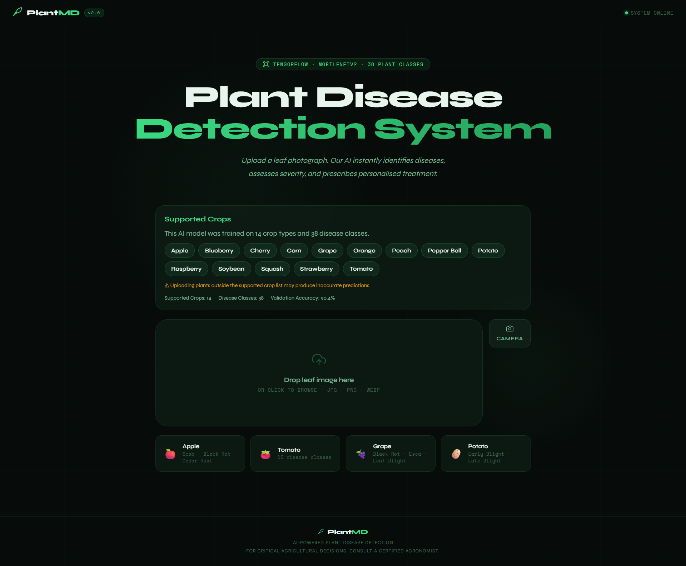

# PlantMD — AI Plant Disease Detection

PlantMD is a full-stack web application that uses a MobileNetV2-based deep learning model to detect diseases across 38 plant-disease classes from the [PlantVillage dataset](https://www.kaggle.com/datasets/abdallahalidev/plantvillage-dataset).

---

## UI Preview



---

## 🗂 Project Structure

```
plantmd/
├── ai-server/           # FastAPI + TensorFlow inference server (Python)
│   ├── main.py
│   ├── train_model.py
│   ├── requirements.txt
│   ├── .env.example
│   ├── Dockerfile
│   └── model/           # Trained .keras model + class_labels.json go here
│
├── backend/             # Node.js / Express proxy + history API
│   ├── server.js
│   ├── package.json
│   ├── .env.example
│   └── Dockerfile
│
├── frontend/            # React + Vite UI
│   ├── src/
│   │   ├── main.jsx
│   │   ├── App.jsx
│   │   ├── index.css
│   │   ├── components/
│   │   │   └── PlantDiseaseDetector.jsx
│   │   ├── utils/
│   │   │   ├── api.js
│   │   │   └── report.js
│   │   └── hooks/
│   │       └── useAnalysis.js
│   ├── index.html
│   ├── vite.config.js
│   ├── package.json
│   └── .env.example
│
├── docker-compose.yml
├── .gitignore
└── README.md
```

---

## Quick Start (Local Development)

### Prerequisites
- Node.js ≥ 18
- Python ≥ 3.10
- (Optional) CUDA-enabled GPU for faster inference

### 1 — Clone and install

```bash
git clone https://github.com/yourname/plantmd.git
cd plantmd

# Backend
cd backend && npm install && cd ..

# Frontend
cd frontend && npm install && cd ..

# AI Server
cd ai-server
python -m venv venv
source venv/bin/activate          # Windows: venv\Scripts\activate
pip install -r requirements.txt
cd ..
```

### 2 — Configure environment variables

```bash
cp backend/.env.example    backend/.env
cp frontend/.env.example   frontend/.env
cp ai-server/.env.example  ai-server/.env
```

### 3 — Train the model (or skip to use mock mode)

```bash
# Download dataset from Kaggle first, then:
cd ai-server
python train_model.py --data ./PlantVillage --epochs 20 --batch 32
```

If you skip training, the AI server runs in **mock mode** — all three services still start and the UI is fully functional with demo predictions.

### 4 — Start all services

**Option A — shell scripts (recommended for development):**

```bash
# Terminal 1
./scripts/start-ai.sh

# Terminal 2
./scripts/start-backend.sh

# Terminal 3
./scripts/start-frontend.sh
```

**Option B — manual:**

```bash
# AI Server (port 8000)
cd ai-server && uvicorn main:app --reload --port 8000

# Backend (port 5000)
cd backend && npm run dev

# Frontend (port 3000)
cd frontend && npm run dev
```

Open **http://localhost:3000** in your browser.

---

## Docker (Production)

```bash
docker-compose up --build
```

Services:
| Service    | Port  |
|------------|-------|
| Frontend   | 3000  |
| Backend    | 5000  |
| AI Server  | 8000  |

---

## 🧪 API Reference

### AI Server (FastAPI · port 8000)

| Method | Path       | Description              |
|--------|-----------|--------------------------|
| GET    | /health   | Model status & metadata  |
| POST   | /predict  | Base64 image → diagnosis |

### Backend (Express · port 5000)

| Method | Path                   | Description                     |
|--------|------------------------|---------------------------------|
| GET    | /api/health            | Checks backend + AI server      |
| POST   | /api/analyse/upload    | Multipart image upload          |
| POST   | /api/analyse/base64    | JSON base64 image               |
| GET    | /api/history           | Recent predictions (last 20)    |
| GET    | /api/history/:id       | Single prediction by ID         |

---

## Model

- **Architecture:** MobileNetV2 (ImageNet pre-trained) + custom classification head
- **Dataset:** PlantVillage — 87,000 images across 38 classes
- **Input size:** 224×224 RGB
- **Reported accuracy:** ~97% on validation split after fine-tuning

---

## Disclaimer

PlantMD is a research / educational tool. For critical agricultural decisions always consult a certified agronomist.

---

## 📄 License

MIT
